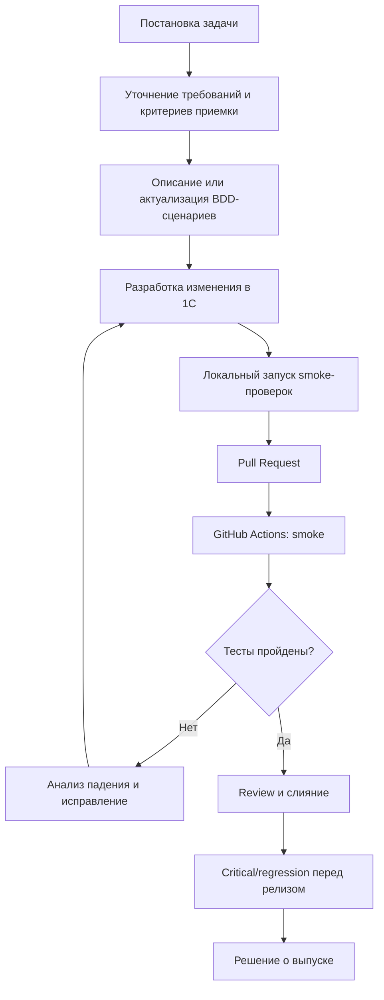

# Целевой процесс To-Be

Целевой процесс интеграции сценарного тестирования строится вокруг связи требований, критериев приемки, BDD-сценариев и автоматического запуска проверок.

## Роли

| Роль | Ответственность |
|---|---|
| Аналитик | Формулирует критерии приемки и согласует бизнес-сценарии |
| Разработчик 1С | Реализует изменение и выполняет локальные проверки |
| Тестировщик | Описывает сценарии, анализирует результаты прогонов |
| Инженер по автоматизации | Развивает библиотеку шагов и повышает устойчивость тестов |
| DevOps-специалист | Настраивает runner, восстановление базы, артефакты и workflow |
| Руководитель проекта | Определяет приоритеты автоматизации и принимает решение о релизе |
